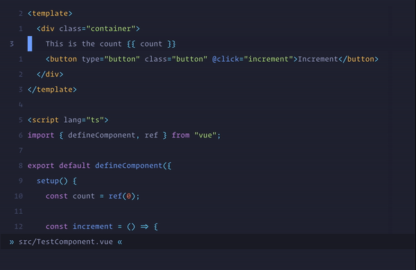
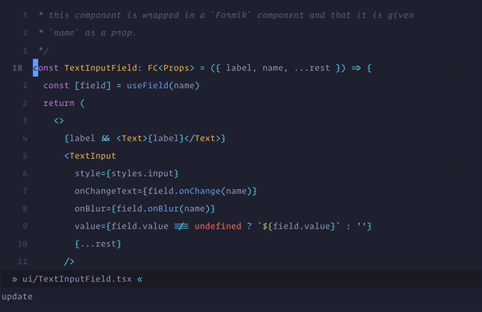
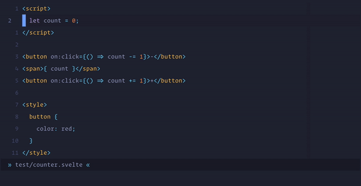
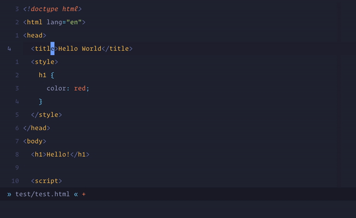
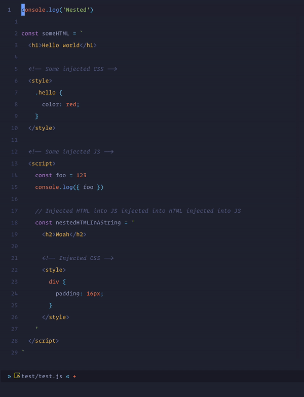

# `nvim-ts-context-commentstring`

A Neovim plugin for setting the `commentstring` option based on the cursor
location in the file. The location is checked via treesitter queries.

This is useful when there are embedded languages in certain types of files. For
example, Vue files can have many different sections, each of which can have a
different style for comments.

Note that this plugin *only* changes the `commentstring` setting. It does not 
add any mappings for commenting. It is recommended to use a commenting plugin 
like [`vim-commentary`](https://github.com/tpope/vim-commentary/) alongside this 
plugin.




## Getting started

**Requirements:**

- [Neovim version 0.5](https://github.com/neovim/neovim/releases/tag/v0.5.0)
- [`nvim-treesitter`](https://github.com/nvim-treesitter/nvim-treesitter/)

**Installation:**

Use your favorite plugin manager. For example, here's how it would look like
with Packer:

```lua
use 'JoosepAlviste/nvim-ts-context-commentstring'
```

**Setup:**

Enable the module from `nvim-treesitter` setup

```lua
require'nvim-treesitter.configs'.setup {
  context_commentstring = {
    enable = true
  }
}
```

Don't forget to use [lua
heredoc](https://github.com/nanotee/nvim-lua-guide#using-lua-from-vimscript) if
you're using `init.vim`

**Recommended: Using a commenting plugin**

It is recommended to use a commenting plugin like 
[`vim-commentary`](https://github.com/tpope/vim-commentary/) together with this 
plugin. `vim-commentary` provides the mappings for commenting which use the 
`commentstring` setting. This plugin adds to that by correctly setting the 
`commentstring` setting so that `vim-commentary` can do its thing even in more 
complex filetypes.

There are ways to make this plugin more efficient with some commenting plugins. 
See the [Integrations](#integrations) section for more information.


## Configuration

### Adding support for more languages

Currently, the following languages are supported when they are injected with 
language tree (see 
[`lua/ts_context_commentstring/internal.lua`](./lua/ts_context_commentstring/internal.lua)):

- `javascript`
- `typescript`
- `tsx`
- `css`
- `scss`
- `php`
- `html`
- `svelte`
- `vue`
- `handlebars`
- `glimmer`
- `graphql`
- `lua`

This means that in any filetype, if the given languages are injected, this 
plugin should detect them and correctly set the `commentstring`. For example, 
Vue files can be injected with `css` or `javascript`. Even though we don't 
configure anything for Vue explicitly, the `commentstring` updating logic should
still work.

Support for more languages can be added quite easily by passing a `config` table
when configuring the plugin:

```lua
require'nvim-treesitter.configs'.setup {
  context_commentstring = {
    enable = true,
    config = {
      css = '// %s'
    }
  }
}
```

Additionally, some languages are not injected with language tree, but have 
multiple commenting styles in the same language. One such example is JavaScript 
with JSX. The JSX section is not an injected language, but a part of the tree 
generated by the `javascript` treesitter parser.

In this more complex case, this plugin supports adding queries for specific 
treesitter nodes. Each node can have its own unique commenting style. For 
example, here's how the default configuration for `javascript` would look like:

```lua
require'nvim-treesitter.configs'.setup {
  context_commentstring = {
    enable = true,
    config = {
      javascript = {
        __default = '// %s',
        jsx_element = '{/* %s */}',
        jsx_fragment = '{/* %s */}',
        jsx_attribute = '// %s',
        comment = '// %s'
      }
    }
  }
}
```

The `__default` value is used when none of the other node types are seen. The 
rest of the keys refer to the type of the treesitter node. In this example, if 
your cursor is inside a `jsx_element`, then the `{/* %s */}` `commentstring` 
will be set.

Note that the language refers to the *treesitter* language, not the filetype or 
the file extension.

Additionally, it is possible to have each `commentstring` configuration be a 
table with custom keys. This can be used to configure separate single and 
multi-line comment styles (useful when integrating with a commenting plugin):

```lua
require'nvim-treesitter.configs'.setup {
  context_commentstring = {
    enable = true,
    config = {
      typescript = { __default = '// %s', __multiline = '/* %s */' }
    }
  }
}
```

Then, the custom key can be passed to `update_commentstring`:

```lua
require('ts_context_commentstring.internal').update_commentstring({
  key = '__multiline',
})
```

Finally, it is possible to customize the tree traversal start location when 
calling `update_commentstring`, this is useful in commenting plugin 
integrations. There are some useful helper functions exported from 
`ts_context_commentstring.utils`:

```lua
require('ts_context_commentstring.internal').calculate_commentstring {
  location = require('ts_context_commentstring.utils').get_cursor_location(),
}
```

If you want to calculate your own `commentstring` you are able to do so with
the `custom_calculation` option:

```lua
require'nvim-treesitter.configs'.setup {
  context_commentstring = {
    enable = true,
    custom_calculation = function(node, language_tree)
        ...
    end
  }
}
```

This is a function that takes in the current node and the language tree which
could be used for context like figuring out which language you should use a 
`commentstring` for. You can also for example figure out which type the current
node is. You need to return a `commentstring` in the `custom_calculation` if you 
want it to be set.

### Behavior

The default behavior is to trigger `commentstring` updating on `CursorHold`. If
your `updatetime` setting is set to a high value, then the updating might not
be triggered. Let me know if you'd like to have this be customized by creating
an issue. Another candidate might be the `CursorMoved` autocommand.

The default `CursorHold` autocommand can be disabled by passing `enable_autocmd 
= false` when setting up the plugin:

```lua
require'nvim-treesitter.configs'.setup {
  context_commentstring = {
    enable = true,
    enable_autocmd = false,
  }
}
```

Then, you can call the `update_commentstring` function manually:

```lua
nnoremap <leader>c <cmd>lua require('ts_context_commentstring.internal').update_commentstring()<cr>
```

**Note:** It is not necessary to use this option if you are using 
`vim-commentary`, the integration is set up automatically.


### Integrations

For some commenting plugins, it's possible to trigger the `commentstring` 
calculation only when it is actually needed. Some commenting plugins require 
more configuration than others.

Let me know if you'd like to see more integrations for other commenting plugins. 
A PR is always appreciated :)


#### [`vim-commentary`](https://github.com/tpope/vim-commentary/)

There is an existing integration with `vim-commentary`, which triggers the 
`commentstring` updating logic only when needed (before commenting with `gc`). 
If `vim-commentary` is detected, then this plugin automatically sets up 
`vim-commentary` mappings to first update the `commentstring`, and then trigger 
`vim-commentary`.


#### [`kommentary`](https://github.com/b3nj5m1n/kommentary)

`kommentary` can also trigger the `commentstring` updating logic before 
commenting. However, it requires some configuration to set up.

First, disable the `CursorHold` autocommand of this plugin:

```lua
require'nvim-treesitter.configs'.setup {
  context_commentstring = {
    enable = true,
    enable_autocmd = false,
  }
}
```

Then, configure `kommentary` to trigger the `commentstring` updating logic with 
its `hook_function` configuration:

```lua
require('kommentary.config').configure_language('typescriptreact', {
  single_line_comment_string = 'auto',
  multi_line_comment_strings = 'auto',
  hook_function = function()
    require('ts_context_commentstring.internal').update_commentstring()
  end,
})
```

Note that currently the `'default'` language configuration
[does not run](https://github.com/b3nj5m1n/kommentary/blob/main/lua/kommentary/config.lua#L316)
`hook_function`, so explicit language configurations will need to be
supplied as shown above. See
[issue #19](https://github.com/JoosepAlviste/nvim-ts-context-commentstring/issues/19#issuecomment-916334428).

#### [`nvim-comment`](https://github.com/terrortylor/nvim-comment)

`nvim-comment` can easily be configured to trigger the `commentstring` updating
logic before commenting.

First, disable the `CursorHold` autocommand of this plugin:

```lua
require'nvim-treesitter.configs'.setup {
  context_commentstring = {
    enable = true,
    enable_autocmd = false,
  }
}
```

Then, configure `nvim_comment` to trigger the `commentstring` updating logic with 
its `hook` configuration:

```lua
require("nvim_comment").setup({
  hook = function()
    require("ts_context_commentstring.internal").update_commentstring()
  end,
})
```

#### [`Comment.nvim`](https://github.com/numToStr/Comment.nvim)

First, disable the `CursorHold` autocommand of this plugin:

```lua
require'nvim-treesitter.configs'.setup {
  context_commentstring = {
    enable = true,
    enable_autocmd = false,
  }
}
```

Then, configure `Comment.nvim` to trigger the `commentstring` updating logic 
with its `pre_hook` configuration (note that we can add some extra logic to 
improve the integration granularity):

```lua
require('Comment').setup {
  pre_hook = function(ctx)
    local U = require 'Comment.utils'

    local location = nil
    if ctx.ctype == U.ctype.block then
      location = require('ts_context_commentstring.utils').get_cursor_location()
    elseif ctx.cmotion == U.cmotion.v or ctx.cmotion == U.cmotion.V then
      location = require('ts_context_commentstring.utils').get_visual_start_location()
    end

    return require('ts_context_commentstring.internal').calculate_commentstring {
      key = ctx.ctype == U.ctype.line and '__default' or '__multiline',
      location = location,
    }
  end,
}
```

#### [`mini.comment`](https://github.com/echasnovski/mini.nvim#minicomment)

`mini.comment` also relies on `commentstring` option and implements hook functionality. It can be used to configure updating `commentstring` before commenting.

First, disable the `CursorHold` autocommand of this plugin:

```lua
require'nvim-treesitter.configs'.setup {
  context_commentstring = {
    enable = true,
    enable_autocmd = false,
  }
}
```

Then, configure `mini.comment` to trigger the `commentstring` updating logic by supplying custom `config.hooks.pre`:

```lua
require('mini.comment').setup({
  hooks = {
    pre = function()
      require('ts_context_commentstring.internal').update_commentstring()
    end,
  },
})
```

## More demos

**React:**



**Svelte:**



**HTML:**



**Nesting:**

I injected HTML into JavaScript strings and created multiple levels of nesting 
with language tree. This sort of nesting of languages works without any extra 
configuration in the plugin.


